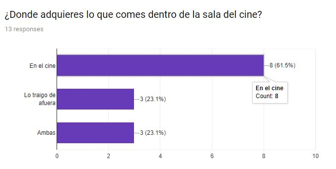
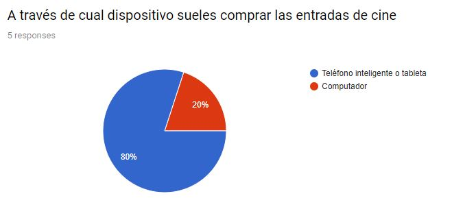

# App MovieNow

#### Descripcion: Proyecto UX Design.App que facilita la adquisicion de entradas al cine y confiteria con descuentos. hecho para Laboratoria 2018.
#### Desarrollado para [Laboratoria](http://www.laboratoria.la/)
#### Tecnología usada: Marvel app, Tecnicas de ideación, arquetipos de persona, journey map, research user, entrevistas, encuestas.

[ver prototipo aqui](https://marvelapp.com/84755ee)

#### Tecnologia Usada: Marvel app (prototipado) 

Tecnicas de Investigación: User Research, Entrevistas, y encuestas, arquetipos o user person, viaje del usuario o Journey map.

##### Movie Now (app)

Una app que te permite comprar  entradas,  elegir entre los diferentes cines asociados y aplicar los descuentos que estos ofrecen de forma online, así como comprar la comida por la misma vía y ahorrarse de hacer fila, y gastar más dinero.

 Proporcionando  al usuario el poder llegar al cine y retirar en una caja preferencial su comida y presentar su teléfono o correo para entrar a la sala de cine a disfrutar de su película y no perderse ni un minuto.

#### Proceso de Investigación y Análisis de los datos

#### Arquetipos de Usuarios

#### Journey Map Usuarios

## Encuesta

## Definiendo Problemática

La problemática existente o que se determinó en base a la observación, entrevistas y encuestas que se realizarón para este estudio se hallaron  3 puntos de dolor o problemas que presentan los usuarios:
* 1 El primero de ellos, largas filas para comprar entradas de manera presencial 
* 2 El segundo también mucha fila para comprar comida 
* 3 Y el tercero es no poder usar todas las promociones del cine en su página web o app, ya que se exige sean presencial. Lo cual a su vez genera o aumenta la fila para comprar entradas de cine

## Diseño del Wireframe

[ver Prototipo aqui](https://marvelapp.com/84755ee)

